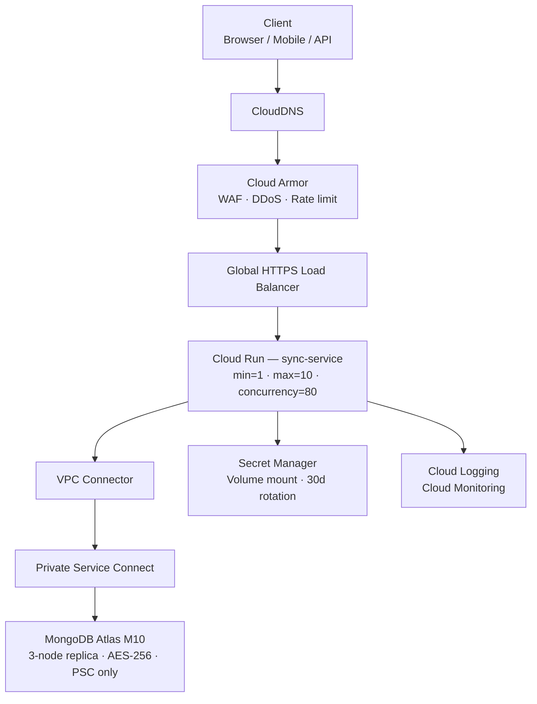

## 1. Architecture




**How a request flows:**
1. Client hits Cloud DNS → Cloud Armor inspects it (WAF + rate limiting)
2. Load Balancer terminates SSL, routes to Cloud Run
3. Cloud Run processes request, reads secrets from mounted volume
4. DB calls go via VPC Connector → Private Service Connect → MongoDB Atlas
5. Everything is in private subnet of VPC except the load balancer frontend which is on the public internet

**Three requirements:**

| Requirement | Solution |
|---|---|
| Auto-scaling | Cloud Run scales on concurrency. `min=1` keeps one warm instance, `max=10` caps cost |
| Secure access | No public DB endpoint. Secrets as file mounts, not env vars. All traffic through Cloud Armor |
| Reasonable cost | Cloud Run near-zero at idle. Atlas M10 at ~$60 is the biggest line item. Firestore Enterprise is also a good solution with Serverless DB which is compatible with MongoDB APIs.  |

---

## 2. Compute — Cloud Run

### Why Cloud Run

| Option | Cost (1k req/day) | Ops Overhead | Verdict |
|---|---|---|---|
| **Cloud Run** | **~$3–8/month** | **Minimal** | **✅ Use this** |
| GKE  | ~$100-150/month | Medium (K8s YAML) | Migrate here at 3+ services |
| App Engine Flex | ~$50-100/month | Low–Medium | Always-on billing even at idle |

Cloud Run scales to zero when idle, handles concurrency-based scale-out automatically, and includes a load balancer. No cluster management needed.

### How Scaling Works

Cloud Run adds instances when all running ones hit the concurrency limit. With `concurrency=80`, one instance handles 80 parallel requests. When that fills, a new instance starts.

- `--min-instances=1` — keeps one container permanently warm, no cold start from zero
- `--max-instances=10` — hard cap, without it Cloud Run defaults to 1,000 (surprise bill risk)
- At `max=10`, `concurrency=80` → handles up to 800 concurrent requests

**Cost of keeping one instance warm: ~$3/month** (memory-only billing at idle, no CPU charge).

### Cold Start Mitigations

| Mitigation | Cost | Effect |
|---|---|---|
| `--min-instances=1` | ~$3/month | Eliminates scale-from-zero entirely |
| `--cpu-boost` | Free | Extra CPU at startup → faster JVM init |
| Slim Docker base image | Build effort | Shorter image pull time |
| GraalVM native image | High build effort | Sub-500ms cold start |

---

## 3. Database — MongoDB Atlas M10

### Tier Choice

| Tier | Cost | Private Endpoint | Verdict |
|---|---|---|---|
| M0 Free | $0 | ❌ No | Not for production PII |
| Atlas Flex | $9–25 | ❌ No | MVP only |
| **M10 Dedicated** | **~$60/month** | **✅ Yes** | **✅ Use this** |
| Self-hosted on GCE | ~$30–60 | ✅ Yes | Too much ops work |

M0 and Flex run on shared infrastructure — Private Service Connect unavailable, database would be publicly accessible. Hard no for PII data.

Self-hosting saves ~$25/month but you own replica management, patching, backups, and failover testing. Not worth it for a 1–2 person team in a startup.

### What is included in M10

- Dedicated 3-node replica set (not shared)
- AES-256 encryption at rest — on by default
- TLS 1.2+ enforced in transit
- Private Service Connect — traffic never hits the public internet
- Point-in-time recovery (PITR) backups
- Audit logging on auth events (required for GDPR)
- Compute and storage auto-scaling (M10 → M20 automatically)

### Required Security Config


Network Access:
- Add Private Endpoint (Private Service Connect → GCP)
- IP allowlist: deny ALL public IPs
- Disable public cluster endpoint

Advanced:
- Audit Logging → AUTH operations
- Encryption at Rest: enabled
- TLS minimum 1.2

---

## 4. Networking

### VPC Layout

```
VPC: sync-vpc (10.0.0.0/16)  —  us-central1
├── connector-subnet   10.0.1.0/28   Serverless VPC Access Connector
├── reserved-private   10.0.2.0/24   Future GKE / GCE expansion
└── PSC Endpoint       10.0.3.x      MongoDB Atlas private connection
```

No public subnet for backend services. The VPC connector is only the outbound path from Cloud Run to Atlas and Secret Manager.

### Public vs Private Boundary

| Component | Exposure | Why |
|---|---|---|
| Cloud DNS | Public (HTTPS only) | Clients need to reach the API |
| Load Balancer | Public | Entry point — Cloud Armor in front |
| Cloud Run service | Private (LB-only) | `internal-and-cloud-load-balancing` feature in Cloud Run to accept traffic from LB only |
| Secret Manager | Private (IAM-only) | No network access without valid SA credentials |
| MongoDB Atlas | Private (PSC only) | Public endpoint disabled, only reachable via 10.0.3.x |

### Cloud Armor Rules

```
Policy: sync-service-armor-policy

Rule 1: sqli-stable          Block SQL injection
Rule 2: xss-stable           Block cross-site scripting
Rule 3: 100 req/min per IP   Rate limiting — credential stuffing protection
Default: ALLOW
```

Cost: ~\$5/month for the policy + ~$0.02/month in request evaluation at startup scale.

---

## 5. Secrets & IAM

### Secret Inventory

| Secret | Contents | Rotation |
|---|---|---|
| `sync-service/mongodb-uri` | Atlas connection string + credentials | 30 days (automated) |
| `sync-service/api-key` | Downstream API keys | 90 days |


### Service Account

One dedicated SA per service, scoped to minimum required permissions.

```
sync-service-sa@PROJECT.iam.gserviceaccount.com
```

| Role | Scope | Why |
|---|---|---|
| `secretmanager.secretAccessor` | Per-secret only | Read secrets — not project-wide |
| `logging.logWriter` | Project | Write structured logs |
| `monitoring.metricWriter` | Project | Emit custom metrics |

> **No SA key files.** Cloud Run uses Workload Identity natively.

### How Spring Boot Reads Secrets

**Use volume mounts for credentials** — the value never appears in env dumps or `gcloud run services describe` output.

```bash
# Deploy flag
--set-secrets=/secrets/mongodb-uri=sync-service/mongodb-uri:latest
```

```properties
# application.properties
spring.data.mongodb.uri=${file:/secrets/mongodb-uri}
```

### Secret Rotation Flow

Secret Manager sends a `SECRET_ROTATE` event to Pub/Sub on schedule. A Cloud Function handles the actual rotation.

| Step | Action |
|---|---|
| 1 | Generate new Atlas password |
| 2 | Update Atlas user via Admin API |
| 3 | Verify new credential connects |
| 4 | Add new version to Secret Manager |
| 5 | Trigger Cloud Run redeploy |
| 6 | Verify service health after deploy |
| 7 | Disable old secret version after 24-hour grace period |
| On failure | Alert and roll back traffic to previous revision |

The 24-hour grace period lets the old revision drain cleanly and gives you a rollback path.

```bash
# Set rotation schedule
gcloud secrets update sync-service/mongodb-uri \
  --rotation-period="2592000s" \
  --next-rotation-time="2025-06-01T00:00:00Z" \
  --topics="projects/PROJECT_ID/topics/sync-service-rotation"
```

---

## 6. Observability

### Stack

**Cloud Logging + Cloud Monitoring** receive Cloud Run metrics automatically — no agents, no config. This is the right default for a startup.

**Grafana OSS (optional)** — run as a Cloud Run service with `min-instances=0`. Costs nothing when idle. Useful for pulling Atlas + GCP metrics into one dashboard.

### Structured Logging

```properties
# Spring Boot 3.4+ — write JSON to stdout, Cloud Run ships it automatically
logging.structured.format.console=ecs
```

Every log entry must include: `severity`, `timestamp`, `traceId`, `spanId`, `httpMethod`, `httpPath`, `statusCode`, `latencyMs`, `userId`.

### Metrics to Watch

| Metric | Alert When |
|---|---|
| Request latency p99 | > 2,000ms for 5 min |
| 5xx error rate | > 1% of requests for 10 min |
| Instance count | At max=10 for 5 min (hitting ceiling) |
| CPU utilization | > 80% average for 10 min |
| Memory utilization | > 85% average for 10 min |

### Custom Log-Based Metrics

```bash
# MongoDB connection failures
gcloud logging metrics create mongodb-connection-errors \
  --log-filter='resource.type="cloud_run_revision"
    AND severity="ERROR"
    AND jsonPayload.message=~"MongoTimeoutException|MongoSocketException"'

# Secret Manager access failures
gcloud logging metrics create secret-access-failures \
  --log-filter='protoPayload.serviceName="secretmanager.googleapis.com"
    AND protoPayload.status.code!=0'
```

---

## 7. Cost

### Startup Phase (~1,000 requests/day)

| Component | Service | Monthly |
|---|---|---|
| Compute | Cloud Run (min=1, 512Mi, 1 vCPU) | ~$3–8 |
| Database | MongoDB Atlas M10 | ~$60 |
| Networking | VPC Connector + LB forwarding rule | ~$8–12 |
| WAF | Cloud Armor | ~$5–8 |
| Secrets | Secret Manager (4 secrets + rotation) | ~$0.20 |
| Logging/Monitoring | Cloud Logging + Cloud Monitoring | ~$0–3 |
| DNS | Cloud DNS | ~$0.50 |
| Container Registry | Artifact Registry (~500MB) | ~$0.10 |
| **Total** | | **~$85–100/month** |

Atlas M10 is ~65–70% of the total bill.

